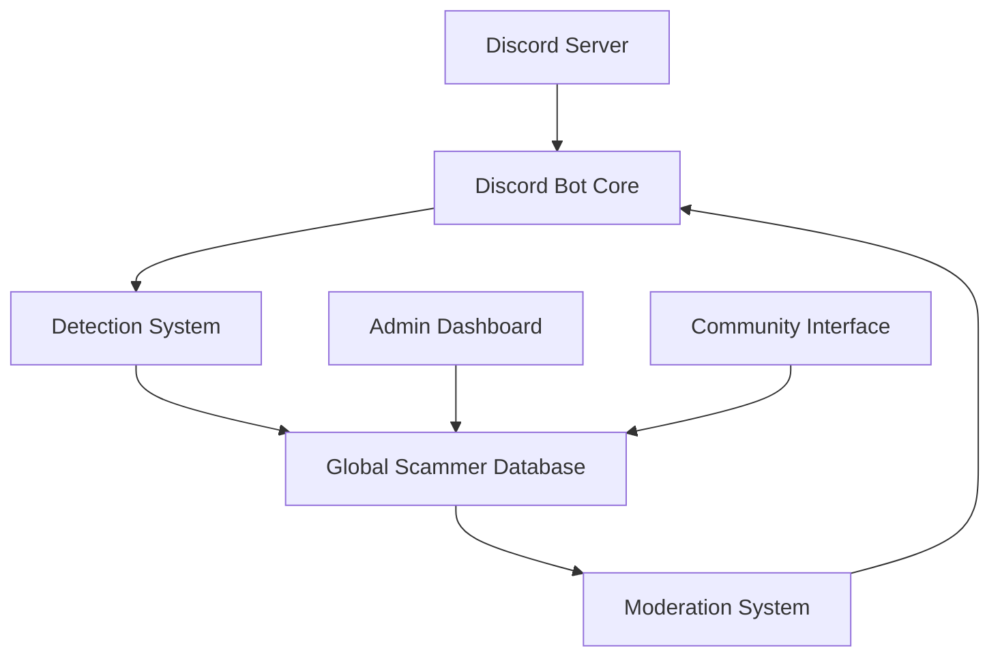

# Discord Scammer Defense - Project Overview

## Vision

Discord Scammer Defense (DSD) is designed to protect Discord communities from scammer impersonators who mimic server owners and staff. The project aims to create a global, community-driven defense system that can quickly identify and respond to scam attempts while maintaining accuracy through human verification.

## Core Components

### 1. Discord Bot Core
- Monitors server events (joins, profile updates, messages)
- Interfaces with Discord's API
- Handles command processing and user interactions

### 2. Detection System
- Rule-based profile analysis
- Image comparison for avatar matching
- Username and behavior pattern detection
- No initial machine learning to keep it simple and reliable

### 3. Global Scammer Database
- Centralized repository of confirmed scammer profiles
- Cross-server intelligence sharing
- API for data access and updates
- Appeal tracking system

### 4. Moderation System
- Automated actions based on detection results
- Customizable per-server settings
- Logging and notification system
- Integration with existing moderation workflows

### 5. Community Features
- Appeal process for flagged accounts
- Point-based reward system for moderators
- Leaderboards and recognition system
- Community voting on appeals

### 6. Admin Dashboard
- Server configuration interface
- Analytics and reporting
- Moderation action management
- Appeal review system

## System Architecture

## Technology Stack

### Backend
- Node.js (Discord Bot)
- Python/Flask (API Server)
- PostgreSQL (Database)
- Redis (Caching)

### Frontend
- React (Admin Dashboard)
- Material-UI (UI Components)

### Infrastructure
- Docker
- GitHub Actions (CI/CD)
- Cloud Hosting (AWS/GCP)

## Security Considerations

1. Data Protection
   - Encryption at rest and in transit
   - Regular security audits
   - Limited data retention

2. Access Control
   - Role-based permissions
   - API authentication
   - Audit logging

3. Rate Limiting
   - API request limits
   - Command cooldowns
   - Anti-abuse measures

## Scalability

The system is designed to scale horizontally:
- Microservices architecture
- Load balancing
- Database sharding capabilities
- Caching layers

## Future Expansion

1. Phase 1: Core Features
   - Basic detection system
   - Essential moderation tools
   - Simple dashboard

2. Phase 2: Community Features
   - Appeal system
   - Reward points
   - Enhanced analytics

3. Phase 3: Advanced Features
   - Machine learning integration
   - API partnerships
   - Extended platform support

## Success Metrics

1. Operational Metrics
   - Detection accuracy rate
   - False positive rate
   - Response time

2. Community Metrics
   - Number of participating servers
   - Active moderator count
   - Appeal resolution time

3. Impact Metrics
   - Reduction in successful scam attempts
   - Community trust score
   - User satisfaction rating